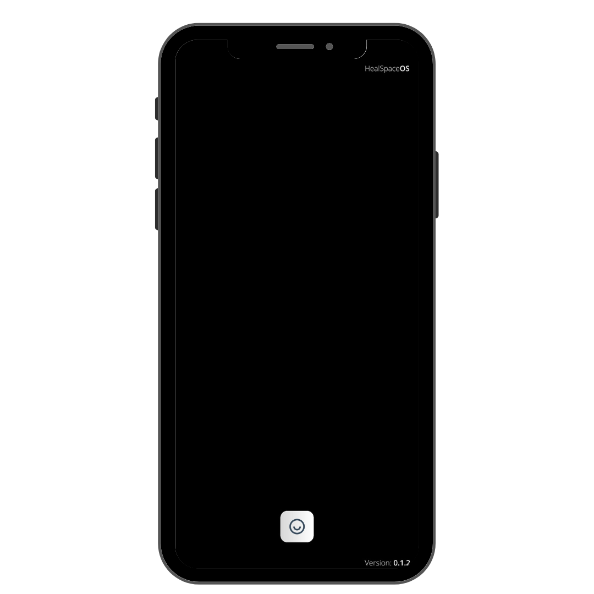
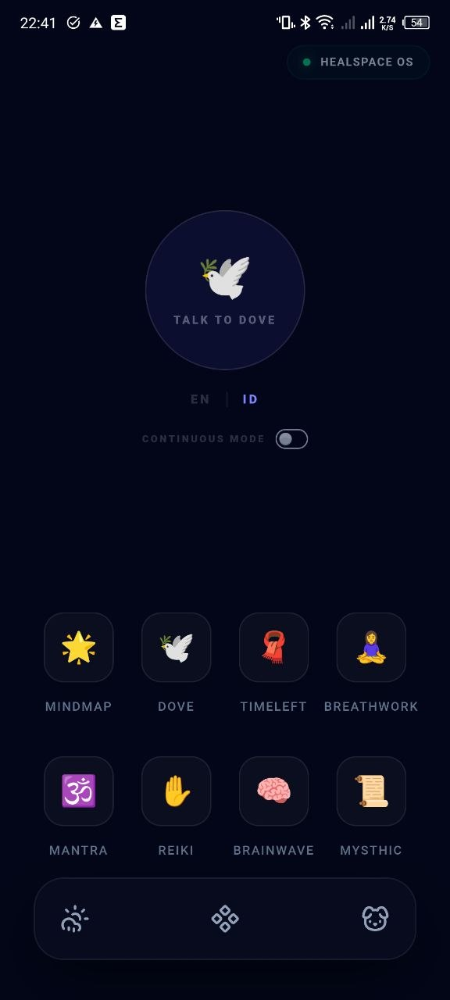
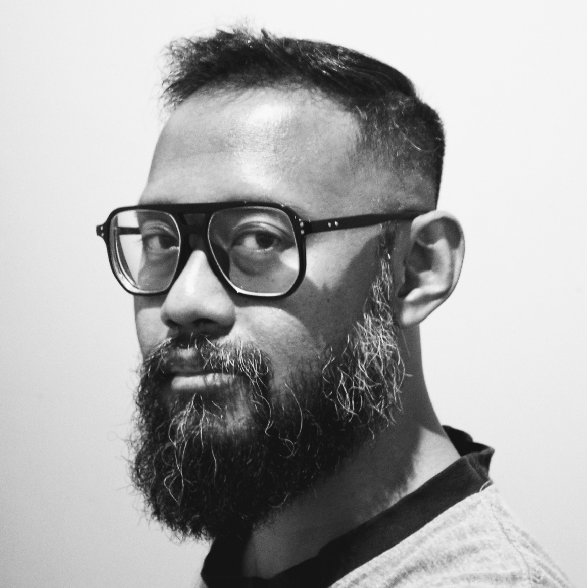
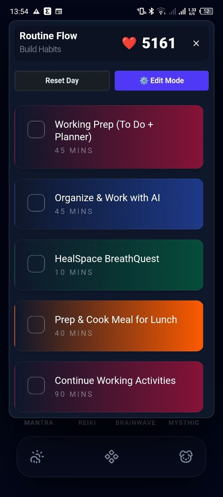
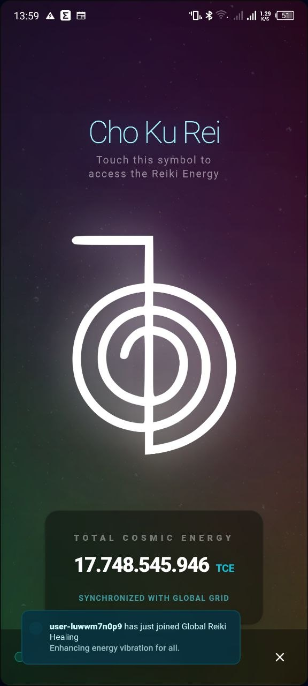
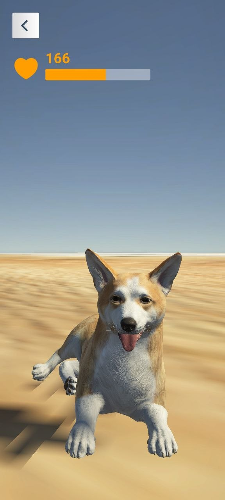
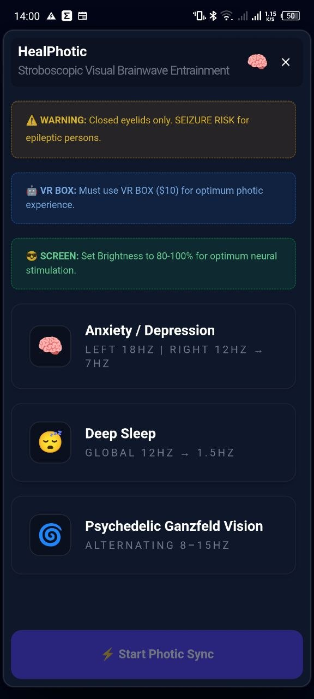
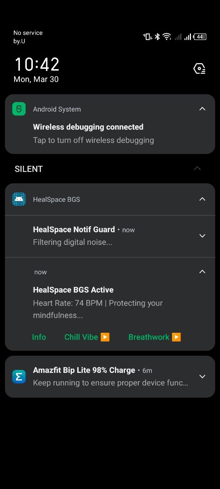

# HealSpace OS @ GitHub Cloud
<!--

-->

<!--### Launch the Cloud Operating System <a href="https://healspaceos.github.io/HOSWebGL/">here (for Phone)</a>-->
### Download version Alpha 0.1.5 for Android here : https://github.com/healspaceos/healspaceos.github.io/releases/tag/healspaceos
#### HealSpace OS is a specialized operating system dedicated to those with unique needs: the neurodivergent, those recovering from illness, individuals undergoing a spiritual shift, or anyone seeking to detach from tech-giant disruptions.

I personally used this OS during my journey through chronic illness, and it helped me immensely. While I hope to have more time left, I might be long gone by the time you read this. My hope is that this GitHub page carry the esoteric will of my intent: helping you through your hardest times.

This OS focuses on:
- Aligning Energy with Humming Mantra
- Reducing Anxiety with Practical Breathwork and Visual Stroboscopic Brainwave Stimulation (HealPhotic)
- Emitting Reiki Energy through the Esoteric Portal
- Helping Build Mindful Habits
- And many more you can explore

Read more about my research on Visual Stroboscopic Brainwave Stimulation (HealPhotic) here in https://healphotic-research-healspaceos.pages.dev or http://healphotic.research.hos.han.ovh

I hope this OS can help you get better, or at least assist you in preparing for the inevitable.

I chose to host this website and OS on GitHub to ensure its long-term preservation. As I may no longer be around to handle periodic domain and hosting renewals, this GitHub ensures that HealSpace OS remains accessible even in my absence.

<i>With Love,</i>

<i>Hartadi</i>

<i>Last Update 2026-03-29</i>

#### Routine Flow with Social Reward Worldwide
Anonymous users around the world will support us with 'Love' each time we check/finish a routine.

#### Reiki healing together with other users worldwide 24/7
Join global esoteric grid of reiki practitioner in this 24/7 reiki healing session.

#### Virtual Pet
Petting and showing some love :-)

#### HealPhotic (Brainwave)
Stroboscopic Visual Brainwave Entrainment using very affordable VR-Box (Google Cardboard).

#### Screenshot of HealSpace OS Bubble Ground Service
Wrapping many HealSpace OS functions in Notification Bar for easier access from any active app.

